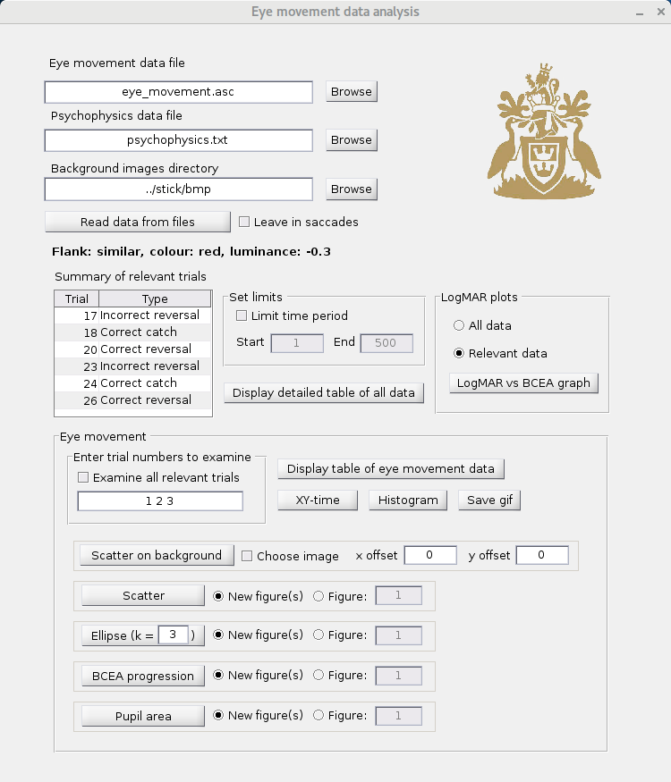
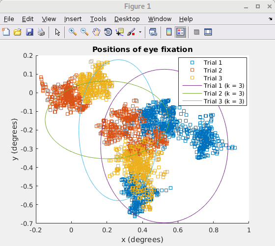
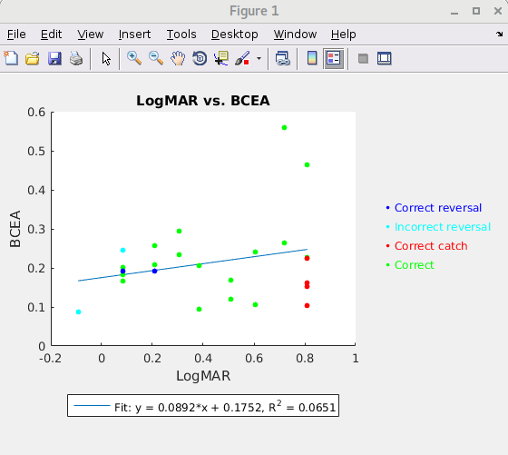

Eye Movement Data Analysis Program
==================================

Program for Anglia Ruskin University to read data and generate graphs and
tables.

General screenshot:

Screenshot of scatter graph of eye movement data:

Screenshot of generated graph showing logMAR vs BCEA:

Screenshot of overview table:

